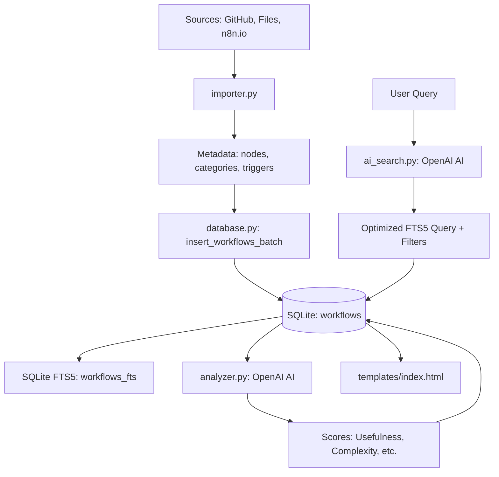

# n8n Hub — Архітектура та інструкції для AI-асистентів

> Цей файл містить повний опис проєкту для AI-асистентів (Claude, GPT тощо),
> які будуть допрацьовувати додаток.

## Що це за проєкт

**n8n Hub** — веб-додаток для пошуку, перегляду та управління колекцією n8n воркфлоу.
Дозволяє імпортувати JSON воркфлоу з різних джерел (GitHub, n8n.io, файли, локальна папка),
індексувати їх у SQLite з повнотекстовим пошуком (FTS5), фільтрувати за категоріями та типами нод.

**Мова інтерфейсу:** українська.

---

## Стек технологій

| Технологія | Версія | Призначення |
|---|---|---|
| Python | 3.11+ | Backend |
| FastAPI | 0.115+ | Web framework (ASGI) |
| Uvicorn | 0.34+ | ASGI server |
| SQLite + FTS5 | вбудований | БД + повнотекстовий пошук |
| Jinja2 | 3.1+ | HTML шаблони |
| httpx | 0.28+ | Async HTTP клієнт (GitHub API, n8n.io) |
| openai | 1.57+ | OpenAI API для аналізу та пошуку |
| starlette SessionMiddleware | — | Session-based авторизація |
| python-multipart | — | Обробка файлів (upload) |
| itsdangerous | — | Підпис сесій |

---

## Структура файлів

```
d:\PROJECT\N8N Find workflows\
├── CLAUDE.md               ← ЦЕЙ ФАЙЛ (архітектура для AI)
├── app.py                  ← FastAPI сервер, API routes, auth (~430 рядків)
├── database.py             ← SQLite + FTS5, CRUD операції (~420 рядків)
├── importer.py             ← Парсинг JSON, імпорт з джерел (~420 рядків)
├── analyzer.py             ← AI-аналіз воркфлоу (OpenAI), retry, rate limit (~275 рядків)
├── ai_search.py            ← AI Chat Search (OpenAI) (~129 рядків)
├── templates/
│   └── index.html          ← Єдиний HTML шаблон, вся UI (~2500 рядків)
├── Dockerfile              ← Docker образ (python:3.12-slim)
├── docker-compose.yml      ← Docker Compose конфігурація
├── .dockerignore           ← Docker ігнорування
├── requirements.txt        ← Python залежності
├── .env.example            ← Приклад env змінних
├── .gitignore              ← Git ігнорування (data/workflows/ ігнорується)
├── README.md               ← Документація для користувачів
└── data/
    └── workflows/          ← ~4186 JSON файлів воркфлоу (НЕ в git, тільки локально)
```

---

## Архітектура

### Архітектурна діаграма



### Як це працює (Логіка)

1.  **Ініціалізація**: При першому запуску (`lifespan`) додаток перевіряє `DB_PATH`. Якщо БД порожня, він сканує `LOCAL_WORKFLOWS_DIR` та виконує масовий імпорт через `insert_workflows_batch`. Також може імпортувати з `INITIAL_REPOS` (GitHub URLs).
2.  **Аналіз метаданих**: `importer.py` не просто читає JSON, а парсить його структуру, рахує ноди та автоматично призначає категорії за типом нод (на основі `NODE_CATEGORIES`). Це дозволяє фільтрувати воркфлоу без AI.
3.  **AI-Збагачення**: `analyzer.py` працює асинхронно. Він бере JSON структуру воркфлоу, відправляє в Gemini та отримує оцінки (1-10) та summary. Це дозволяє ранжувати воркфлоу за якістю.
4.  **Розумний пошук**: Коли користувач пише в чат, `ai_search.py` запитує Gemini: "На що це схоже з наших категорій/нод?". AI повертає не просто відповідь, а параметри для SQL запиту.
5.  **Продуктивність**: Вся база (~4200 записів) працює миттєво завдяки SQLite FTS5 (повнотекстовий пошук) та lookup-таблицям для нод і категорій (O(1) замість O(n)).

### Таблиці БД

| Таблиця | Призначення |
|---|---|
| `workflows` | Основна: id, name, description, nodes (JSON), categories (JSON), node_count, trigger_type, source_url, source_repo, json_content, json_hash (UNIQUE), added_at, updated_at, ai_usefulness, ai_universality, ai_complexity, ai_scalability, ai_summary, ai_tags (JSON), ai_analyzed_at, ai_use_cases (JSON), ai_target_audience, ai_integrations_summary, ai_difficulty_level, **ai_summary_en**, **ai_use_cases_en** (JSON), **ai_target_audience_en**, **ai_integrations_summary_en** |
| `workflow_categories` | Lookup: workflow_id + category_name (для O(1) фільтрів) |
| `workflows_fts` | FTS5 віртуальна таблиця (name, description, nodes, categories, ai_summary, ai_tags, ai_use_cases, ai_target_audience, ai_integrations_summary, ai_summary_en, ai_use_cases_en, ai_target_audience_en, ai_integrations_summary_en). Оновлюється тригерами |
| `users` | Користувачі: id, email (UNIQUE), name, picture, role (user/admin), created_at |
| `user_usage` | Ліміти: user_id (PK), ai_chat_count, last_reset_at |
| `subscriptions` | Підписки: user_id (PK), payment_customer_id, payment_sub_id, status (active/inactive), expires_at |
| `payment_history` | Платежі: id, user_id, payment_order_id, amount, currency, status, created_at |
| `github_repos` | Зареєстровані GitHub репо: id, repo_url (UNIQUE), last_synced, workflow_count, enabled |

**Важливо:** lookup-таблиці `workflow_nodes` та `workflow_categories` дублюють дані з JSON полів `nodes` і `categories` таблиці `workflows`. Це зроблено для швидких фільтрів замість O(n) парсингу JSON. При зміні nodes/categories потрібно оновлювати обидва місця.

### Авторизація

-   **Google OAuth**: Авторизація через `authlib`. При першому вході створюється запис у таблиці `users`.
-   **User Persistence**: На відміну від ранніх версій, користувачі тепер зберігаються в БД.
-   **Адміністратор**: Тільки користувач з email `goodstaffshop@gmail.com` має права адміністратора.
-   **Session-based**: Через `starlette.middleware.sessions.SessionMiddleware`. У сесії зберігається `user['id']` з БД.
-   **Рівні доступу**:
    -   Гість/Користувач: Перегляд, пошук, AI Chat (read-only).
    -   Адмін: Імпорт, видалення воркфлоу, управління GitHub репозиторіями, пакетний AI-аналіз.
-   **Fallback**: Legacy логін `ADMIN_USER`/`ADMIN_PASS` доступний як запасний варіант (backend).

---

## Ключові функції по файлах

### database.py

| Функція | Опис |
|---|---|
| `get_db()` | Thread-local з'єднання SQLite (**DELETE mode**, foreign keys) |
| `init_db()` | Створення таблиць, індексів, FTS5, тригерів + міграції |
| `_migrate_ai_columns()` | Додавання AI-колонок якщо їх ще нема |
| `_migrate_lookup_tables()` | Заповнення lookup-таблиць з існуючих даних (одноразова міграція) |
| `insert_workflow(...)` | Вставка одного воркфлоу + lookup записи |
| `insert_workflows_batch(data)` | Batch вставка в одній транзакції. Повертає (imported, duplicates) |
| `search_workflows(query, category, node, page, sort, min_score)` | FTS5 пошук + фільтри через subquery по lookup-таблицях |
| `get_workflow(id)` | Отримати один воркфлоу за ID |
| `delete_workflow(id)` | Видалити (CASCADE видаляє lookup + FTS) |
| `get_all_nodes()` | `SELECT DISTINCT node_name FROM workflow_nodes` |
| `get_all_categories()` | `SELECT DISTINCT category_name FROM workflow_categories` |
| `get_stats()` | Кількість: workflows, repos, unique nodes, analyzed (де `ai_usefulness > 0`), avg_usefulness |
| `update_workflow_ai(wf_id, ..., result_en)` | Оновити AI-аналіз для воркфлоу (UK + EN) |
| `get_unanalyzed_workflows(limit)` | Вибрати ще не проаналізовані (`ai_analyzed_at` порожній/NULL **або** `ai_usefulness = 0`) |
| `add_github_repo(url)` | Додати репо для синхронізації |
| `get_github_repos()` | Список репо |
| `update_repo_sync(url, count)` | Оновити дату синхронізації |
| `delete_github_repo(id)` | Видалити репо + його воркфлоу |
| `upsert_user(email, ...)` | Створити або оновити користувача при вході |
| `get_user_usage(user_id)` | Отримати кількість AI-пошуків та статус підписки |
| `increment_user_usage(user_id)` | Збільшити лічильник AI-пошуків |
| `get_payment_history(user_id)` | Отримати історію транзакцій |
| `update_subscription(...)` | Оновити статус підписки (WayForPay) |
| `add_payment_record(...)` | Додати запис про платіж |
| `get_admin_users_report()` | Звіт по всіх користувачах (registration + payment stats) |

### importer.py

| Функція | Опис |
|---|---|
| `parse_workflow_json(json_str)` | Парсинг n8n JSON → dict з metadata. Визначає nodes, categories (за NODE_CATEGORIES маппінгом), trigger_type (за TRIGGER_NODES) |
| `import_from_json(json_str)` | Імпорт одного воркфлоу з JSON рядка |
| `import_from_directory(dir_path)` | Batch імпорт всіх *.json з локальної папки |
| `import_from_url(url)` | Маршрутизація: визначає тип URL → відповідний метод |
| `_import_github_raw(url)` | Імпорт одного файлу з raw.githubusercontent.com |
| `_get_default_branch(client, owner, repo)` | Визначення default branch через GitHub API |
| `_import_github_dir(url)` | **ZIP-метод**: завантажує весь репо як ZIP, витягує JSON файли, batch insert |
| `_import_n8n_io(url)` | Імпорт з n8n.io/workflows/ID |
| `sync_github_repo(url)` | Ре-синхронізація одного репо |
| `sync_all_repos()` | Синхронізація всіх enabled репо |

**NODE_CATEGORIES** — маппінг `n8n-nodes-base.slack` → `"Комунікація"` тощо (73 записи, 14 категорій).
**TRIGGER_NODES** — маппінг тригерних нод → тип тригера (8 записів).

### analyzer.py

| Функція | Опис |
|---|---|
| `analyze_workflow(wf)` | Аналіз одного воркфлоу через Gemini. Повертає dict зі scores, summary (UK+EN) та tags |
| `analyze_and_save(wf_id)` | Аналіз + збереження в БД |
| `analyze_batch(limit)` | Пакетний аналіз із паузою **4с** між запитами + **retry з 10с backoff**. Повертає `error_details` зі списком невдалих воркфлоу |

### ai_search.py

| Функція | Опис |
|---|---|
| `translate_query(user_query)` | Конвертує природну мову → параметри пошуку через Gemini |
| `perform_ai_search(query, page)` | Повний AI-пошук: translate → search_workflows → parse → return |

### app.py

| Endpoint | Метод | Опис |
|---|---|---|
| `GET /` | GET | Головна сторінка (Jinja2) |
| `GET /health` | GET | Health check для Docker |
| `POST /api/login` | POST | Авторизація |
| `POST /api/logout` | POST | Вихід |
| `GET /api/search` | GET | Пошук (q, category, node, page, sort, min_score) |
| `GET /api/workflow/{id}` | GET | Деталі воркфлоу |
| `GET /api/workflow/{id}/json` | GET | Завантажити JSON файл |
| `GET /api/workflow/{id}/import` | GET | n8n Import from URL (чистий JSON) |
| `DELETE /api/workflow/{id}` | DELETE | Видалити (auth) |
| `POST /api/import/url` | POST | Імпорт за URL (auth) |
| `POST /api/import/json` | POST | Імпорт JSON тексту (auth) |
| `POST /api/import/file` | POST | Імпорт JSON файлу (auth) |
| `POST /api/import/local` | POST | Імпорт з локальної папки (auth) |
| `GET /api/repos` | GET | Список GitHub репо (auth) |
| `POST /api/repos/sync/{id}` | POST | Синхронізувати репо (auth) |
| `POST /api/repos/sync-all` | POST | Синхронізувати всі (auth) |
| `DELETE /api/repos/{id}` | DELETE | Видалити репо (auth) |
| `POST /api/analyze/{id}` | POST | AI-аналіз одного (auth) |
| `POST /api/analyze/batch` | POST | AI-аналіз партією (auth) |
| `POST /api/chat` | POST | AI Chat Search (ліміт: 3 безкоштовні для user) |
| `GET /api/auth/google/login` | GET | Ініціація Google OAuth |
| `GET /api/auth/google/callback`| GET | Коллбек від Google (auth success) |
| `GET /api/auth/me` | GET | Поточний користувач (avatar, email, usage data, sub status) |
| `POST /api/payments/create-order` | POST | Створення параметрів для WayForPay |
| `POST /api/payments/callback` | POST | Webhook для WayForPay (ServiceUrl) |
| `GET /api/payments/history` | GET | Історія платежів користувача |
| `POST /api/admin/analyze-all` | POST | Аналізувати все AI (admin only) |
| `POST /api/admin/clear-all` | POST | Повне очищення БД (admin only) |
| `GET /api/admin/users` | GET | Список користувачів з аналітикою (admin only) |
| `GET /api/filters` | GET | Списки нод та категорій |
| `GET /api/stats` | GET | Статистика (analyzed = `ai_usefulness > 0`) |

### templates/index.html

Єдиний HTML файл (~1809 рядків), що містить:
-   **CSS** (~1056 рядків): Dark theme, CSS custom properties, responsive, AI chat стилі
-   **HTML** (~226 рядків): Header, stats bar, search/filters, grid, 5 modals (detail, import, auth, repos), AI chat widget
-   **JavaScript** (~527 рядків): Vanilla JS, no frameworks
    -   Пошук з debounce 300ms
    -   Рендер карток та пагінації з AI scores
    -   Імпорт (3 таби: URL, JSON, File)
    -   Управління репозиторіями
    -   AI Chat Search (floating widget)
    -   AI аналіз окремих воркфлоу та batch
    -   Instant Import URL для n8n
    -   Toast notifications
    -   XSS захист через `esc()` функцію

---

## Змінні оточення

| Змінна | Default | Опис |
|---|---|---|
| `ADMIN_PASS` | `"changeme"` | Пароль адміністратора (legacy login) |
| `ADMIN_EMAIL` | `"goodstaffshop@gmail.com"` | Google Email адміністратора (безлімітний AI-пошук) |
| `SECRET_KEY` | `n8n-hub-secret-key-change-me` | Ключ для підпису сесій |
| `DB_PATH` | `./workflows.db` | Шлях до SQLite БД |
| `LOCAL_WORKFLOWS_DIR` | `./data/workflows` | Папка з JSON воркфлоу для автоімпорту при першому запуску |
| `INITIAL_REPOS` | `""` | Comma-separated GitHub URLs для імпорту при першому запуску |
| `GITHUB_TOKEN` | `""` | GitHub Personal Access Token (для збільшення rate limit) |
| `SYNC_INTERVAL_HOURS` | `24` | Інтервал автосинхронізації GitHub репо (годин) |
| `OPENAI_API_KEY` | `""` | OpenAI API Key |
| `OPENAI_MODEL` | `gpt-4o-mini` | `gpt-4o-mini` (швидко та дешево) або `gpt-4o` |
| `GOOGLE_CLIENT_ID` | `""` | Google OAuth Client ID |
| `GOOGLE_CLIENT_SECRET` | `""` | Google OAuth Client Secret |
| `WFP_MERCHANT_ACCOUNT` | `""` | Логін мерчанта у WayForPay. |
| `WFP_MERCHANT_SECRET_KEY` | `""` | Секретний ключ мерчанта. |
| `WFP_MERCHANT_DOMAIN` | `""` | Домен сайту (наприклад, `https://n8n-hub.com`). |
| `PYTHONUNBUFFERED` | `1` | Рекомендовано для логів |

---

## Поточний стан деплою

### Продакшен: EasyPanel

-   **Сервер**: VPS 144.91.71.55
-   **Домен**: `finder-n8n-templates-finder-n8n-templates.g3fhgi.easypanel.host`
-   **GitHub repo**: `https://github.com/dollarnuk/finder-n8n-templates.git` (branch: main)
-   **Dockerfile**: Python 3.12-slim, порт 8000, healthcheck
-   **Volume**: `n8n-hub-data` → `/data` (SQLite БД)

### Environment vars в EasyPanel:
```
ADMIN_PASS=<ваш пароль>
SECRET_KEY=<ваш secret key>
OPENAI_API_KEY=<ваш OpenAI API key>
OPENAI_MODEL=gpt-4o-mini
GITHUB_TOKEN=<ваш GitHub PAT token>
```
**Реальні значення зберігаються в EasyPanel та .env (не в git).**

**ВАЖЛИВО — НЕ встановлювати** `INITIAL_REPOS=default` або `INITIAL_REPOS=<URL власного коду>`. Або залишити порожнім, або вставити URL з воркфлоу (наприклад DragonJAR).

---

## Що зроблено (повний список)

### Фаза 1 — Базовий функціонал (завершена)

1.  **Thread-local DB з'єднання** — замість створення нового на кожен запит
2.  **Lookup-таблиці** `workflow_nodes` та `workflow_categories` — для O(1) фільтрів замість O(n) парсингу JSON
3.  **Batch import** `insert_workflows_batch()` — в одній транзакції, швидкий масовий імпорт
4.  **Локальний імпорт** `import_from_directory()` — імпорт з локальної ФС без мережі
5.  **GitHub token** — `GITHUB_TOKEN` env var для збільшення rate limit
6.  **Auto branch detection** — `_get_default_branch()` визначає default branch через API
7.  **Повністю працюючий додаток** — пошук, фільтри, авторизація, імпорт, деталі воркфлоу, завантаження JSON

### Фаза 2 — AI-функції (завершена)

1.  **AI-аналіз** (`analyzer.py`): Gemini аналізує кожен воркфлоу → оцінки usefulness/universality/complexity/scalability (1-10) + summary українською + tags
2.  **AI Chat Search** (`ai_search.py`): природна мова → FTS5 запит через Gemini
3.  **Instant Import**: `GET /api/workflow/{id}/import` — пряме посилання для n8n "Import from URL"
4.  **UI для AI**: floating chat widget, AI scores на картках, AI detail view з 4 оцінками, batch аналіз

### Фаза 3 — Docker та деплой (завершена)

1.  **Dockerfile**: python:3.12-slim, healthcheck, persistent volume на `/data`
2.  **docker-compose.yml**: production config з volume
3.  **.dockerignore**: виключає .git, data/, *.db, .env, __pycache__
4.  **.gitignore**: data/workflows/ виключений (73MB JSON файлів)
5.  **Деплой на EasyPanel**: працює, Docker build успішний
6.  **SQLite DELETE mode**: замість WAL (WAL несумісний з Docker overlay FS)
7.  **ZIP-імпорт з GitHub**: завантажує весь репо як ZIP замість поштучних API-запитів (вирішує проблему truncation)

### Відомі проблеми

1.  **GitHub імпорт через INITIAL_REPOS неповний**: DragonJAR repo має ~4200 файлів, але через EasyPanel/Docker обмеження імпортується лише ~700-900. Причина: або timeout при завантаженні великого ZIP, або обмеження пам'яті контейнера.
2.  **Відсутність прогрес-бару**: імпорт з GitHub — довгий процес без зворотного зв'язку в UI.

---

### Фаза 4 — AI-аналіз ПРИ ІМПОРТІ, Валідація та UI (завершена)

1.  **AI-аналіз при імпорті**: Тепер `import_from_json()` та `import_from_url()` автоматично викликають `analyze_and_save()`, якщо передано `analyze=True`.
2.  **Розширені метадані**: Додано поля `ai_use_cases`, `ai_target_audience`, `ai_integrations_summary`, `ai_difficulty_level`. Промпт в `analyzer.py` оновлено для їх генерації.
3.  **Сувора валідація**: `parse_workflow_json()` тепер перевіряє структуру n8n (наявність `nodes`), мінімальний розмір файлу та валідність JSON.
4.  **Покращений UI**:
    -   Підтримка Multi-file upload та Drag & Drop.
    -   Прогрес-бар для пакетного імпорту.
    -   Таблиця результатів зі статусами (OK, Дублікат, Помилка).
    -   Відображення нових AI-даних у модальному вікні деталей.

---

### Фаза 6 — Google Drive та Адмін-панель (завершена)

1.  **Імпорт з Google Drive**: `importer.py` підтримує прямі посилання на файли.
2.  **Адмін-інструменти**:
    -   `doClearAllWorkflows()` — повне видалення бази.
    -   `doAnalyzeAllUnanalyzed()` — масовий аналіз через Gemini.
3.  **UI для адміна**: Окремий розділ у модалці репозиторіїв з "червоними" кнопками.

---

### Фаза 16 — Користувачі та Ліміти на AI-пошук (завершена)

1.  **Персистентність користувачів**: Додано таблицю `users`. Тепер Google OAuth не просто ідентифікує користувача, а зберігає його в базі.
2.  **Ліміти (Usage Tracking)**: Таблиця `user_usage` відстежує кількість викликів `/api/chat`.
3.  **Обмеження 3 пошуків**: Безкоштовні користувачі мають ліміт у 3 AI-запити. Після досягнення ліміту `/api/chat` повертає `403 Forbidden` з інформацією про апгрейд.
4.  **Універсальний Pro Status**: Реалізовано логіку перевірки `sub_status == 'active'` для ігнорування лімітів.
5.  **UI Монетизації**: Додано модальне вікно "Upgrade to Pro", лічильник пошуків у чаті та статус PRO у профілі.

---

### Фаза 17 — Інтеграція WayForPay (завершена)

1.  **Платіжний шлюз**: Обрано WayForPay як локальне та глобальне рішення (замість Stripe для кращої підтримки в Україні).
2.  **Order Creation**: Ендпоінт `/api/payments/create-order` генерує параметри та підпис (HMAC-MD5) для форми оплати.
3.  **Callback Handling**: Ендпоінт `/api/payments/callback` приймає `ServiceUrl` запити від WayForPay для активації підписки.
4.  **Subscription Lifecycle**: Автоматичне оновлення статусу в БД при успішній оплаті.
5.  **UI**: Динамічна форма оплати в `index.html`, відображення ціни в грн (40 грн/міс).

---

### Фаза 7 — Google OAuth Авторизація (завершена)

1.  **Backend Auth**: Інтеграція `authlib`, сесії Starlette.
2.  **Google Login Popup**: Фронтенд відкриває вікно авторизації та отримує результат через `postMessage`.
3.  **Hardcoded Admin**: Чітке обмеження прав для `goodstaffshop@gmail.com`.
4.  **Header Profile**: Відображення аватара та імені користувача з Google.
5.  **Security logic**: `require_auth` декоратор з параметром `admin_only`.

---

### Фаза 8 — Мультимовність (UA + EN) (завершена)

1.  **Двомовний AI-аналіз**: Промпт Gemini генерує аналіз одночасно українською (`uk`) та англійською (`en`). Результати зберігаються в окремих колонках (`ai_summary_en`, `ai_use_cases_en`, `ai_target_audience_en`, `ai_integrations_summary_en`).
2.  **Перемикач мови**: UI підтримує UA/EN через `currentLang`. Якщо для воркфлоу ще немає EN-аналізу, відображається плейсхолдер "Needs AI Analysis (EN)..." замість fallback на українську.
3.  **FTS5 індексація**: Пошукова таблиця FTS5 індексує як українські, так і англійські поля для мультимовного пошуку.
4.  **API параметр `lang`**: `/api/search` приймає `lang=en|uk` для мовно-специфічних результатів.

---

### Фаза 11 — Bug Fixes: UI та i18n (завершена)

1.  **`/api/auth/me` endpoint**: Відновлення відображення Google аватара та email у header.
2.  **i18n fallback**: Виправлена логіка мовних fallback — EN-інтерфейс більше не показує український текст.

---

### Фаза 12 — Виправлення дискрепансії AI-аналізу (завершена)

1.  **Проблема**: Пакетний аналіз повідомляв "всі оброблені", але статистика показувала менше проаналізованих, ніж всього.
2.  **Причина 1**: `get_stats()` та `get_unanalyzed_workflows()` використовували різні критерії для "проаналізовано" — воркфлоу з невдалим AI-аналізом (timestamp є, оцінки = 0) зависали в "мертвій зоні".
3.  **Причина 2**: Gemini Free Tier `gemini-3-flash` має ліміт **20 запитів/день** (не на хвилину!). При аналізі 20+ воркфлоу останні завжди провалювались.
4.  **Виправлення**: Критерій "проаналізовано" = `ai_analyzed_at != '' AND ai_usefulness > 0`. Retry з 10с backoff. Пауза між запитами збільшена до 4с. Тост показує назви невдалих воркфлоу.

---

### Фаза 19 — Адмін-панель користувачів та виправлення стабільності (завершена)

1.  **Admin Users Modal**: Додано інтерфейс для перегляду всіх зареєстрованих користувачів з їхніми датами реєстрації, статусами та лічильниками AI-чатів.
2.  **Надійна ініціалізація БД**: Перехід від `executescript` до покрокового виконання `CREATE TABLE` у `init_db()`. Це запобігає ситуаціям, коли одна помилка (наприклад, у FTS5) блокує створення основних таблиць.
3.  **Агресивна синхронізація сесій**: У ендпоінті `/api/auth/me` додано примусовий `upsert_user`, що гарантує наявність користувача в базі навіть при "кривому" деплої або зміні файлу БД.
4.  **Покращена діагностика**: Фронтенд тепер відображає конкретні тексти помилок від сервера (JSON response) замість загального "Error loading users".

---

### Фаза 9 — Оптимізація та фоновий AI-аналіз (Пріоритет)
-   Перенести `analyze_and_save` у `BackgroundTasks` FastAPI.
-   Пришвидшити імпорт великих GitHub репозиторіїв та Google Drive файлів.
-   Додати індикатор статусу AI-аналізу в UI.

### Фаза 10 — Монетизація та Реліз
-   Підписочна модель: $1-5/місяць
-   Безкоштовний доступ: перегляд, базовий пошук
-   Платний: AI-пошук, завантаження JSON, instant import, доступ до всієї бази
-   Реєстрація користувачів (зараз тільки один admin)
-   Stripe або інша платіжна система

### Конкурентний аналіз
Перед монетизацією потрібно дослідити конкурентів:
-   **n8n.io/workflows** — офіційна бібліотека шаблонів (безкоштовна)
-   Інші третьосторонні n8n-маркетплейси
-   Порівняти функції, UX, ціни

### Інші ідеї
-   [ ] Тегування воркфлоу (кастомні мітки)
-   [ ] Улюблені / обрані воркфлоу
-   [ ] Порівняння двох воркфлоу
-   [x] Мультимовність (UA + EN, двомовний AI-аналіз)
-   [ ] Експорт колекції як ZIP
-   [ ] Статистика популярності (перегляди, завантаження)

---

## Як запустити локально

```bash
# 1. Перейти в папку проєкту
cd "d:\PROJECT\N8N Find workflows"

# 2. Встановити залежності
pip install -r requirements.txt

# 3. Створити .env (скопіювати з .env.example)
# Обов'язково: ADMIN_PASS, SECRET_KEY, GEMINI_API_KEY

# 4. Запустити
uvicorn app:app --host 0.0.0.0 --port 8000
# Або:
python app.py
```

Відкрити: http://localhost:8000

При першому запуску, якщо БД порожня і `LOCAL_WORKFLOWS_DIR` вказує на папку з JSON файлами, автоматично імпортуються всі.

---

## Як деплоїти на EasyPanel (Docker)

### Поточна конфігурація
1.  GitHub repo: `dollarnuk/finder-n8n-templates`, branch `main`
2.  Build path: `/`, Dockerfile: `Dockerfile`
3.  Порт: **8000**
4.  Volume: `n8n-hub-data` → `/data`
5.  Env vars: див. розділ "Поточний стан деплою" вище

### Перебудова
Після push в main, в EasyPanel натиснути "Rebuild" або налаштувати auto-deploy.

```bash
# Або через docker-compose локально:
docker-compose up -d --build
```

---

## Важливі нюанси для розробників

1.  **SQLite DELETE mode (НЕ WAL!)** — `database.py:18` використовує `PRAGMA journal_mode=DELETE`. WAL mode спричиняє `disk I/O error` на Docker overlay filesystem. **Ніколи не змінюйте на WAL для Docker.**

2.  **FTS5 тригери** — при INSERT/UPDATE/DELETE в `workflows` таблиці, FTS5 оновлюється автоматично через SQL тригери. Не потрібно вручну оновлювати `workflows_fts`.

3.  **Lookup-таблиці** — при вставці нового воркфлоу, `insert_workflow()` та `insert_workflows_batch()` автоматично заповнюють `workflow_nodes` і `workflow_categories`. При видаленні, CASCADE автоматично видаляє пов'язані записи.

4.  **JSON hash** — дедуплікація по `json_hash` (SHA256[:16]). Якщо воркфлоу з таким хешем вже є, повернеться `IntegrityError` і він буде пропущений.

5.  **XSS захист** — у фронтенді всі дані проходять через `esc()` функцію перед вставкою в DOM. При додаванні нового коду, завжди використовуйте `esc()` для user-generated content.

6.  **Категорії** — визначаються автоматично за типом нод через `NODE_CATEGORIES` маппінг в `importer.py`. Для додавання нової категорії, додайте маппінг в цей словник.

7.  **OpenAI SDK нюанси**:
    -   Використовуйте `client.chat.completions.create` з `response_format={"type": "json_object"}`.
    -   Викликайте через `asyncio.to_thread()`, оскільки клієнт синхронний (або використовуйте `AsyncOpenAI`).
    -   **Рекомендована модель: `gpt-4o-mini`**.
    -   Пауза між запитами: `await asyncio.sleep(0.5)`.

8.  **AI Search (FTS5)**: `ai_search.py` конвертує запит користувача у JSON з `fts_query`. Це поле автоматично розбивається на слова з оператором `OR` для максимального покриття через FTS5.

9.  **GitHub ZIP імпорт**: `_import_github_dir()` завантажує весь репо як ZIP-архів (одним запитом), витягує JSON файли в пам'яті, batch insert кожні 500 штук. Це вирішує проблему truncation API `git/trees`.

10. **data/workflows/ НЕ в git**: Папка з ~4186 JSON файлами (73MB) додана в .gitignore. Для деплою використовуйте INITIAL_REPOS або імпорт через UI.

11. **Сувора валідація JSON**: `importer.py` містить логіку, яка відхиляє занадто малі файли (<50 байт), невалідний JSON або об'єкти без поля `nodes`. Це запобігає забрудненню БД сміттєвими файлами.

12. **Обробка назв за замовчуванням**: Якщо воркфлоу не має власного імені (поле `name`), система автоматично генерує опис на основі імен перших 10 нод. Це дозволяє зберігати інформативність навіть для "безіменних" шаблонів.

13. **Типізація та стайл-гайд**: Backend використовує Type Hinting для всіх ключових функцій. Коментарі в коді переважно українською мовою для кращої відповідності інтерфейсу. При додаванні нових API ендпоінтів завжди використовуйте `JSONResponse` для одноманітності.

---

## 🐛 Вирішені помилки (лог для AI-асистентів)

> **Мета цього розділу**: щоб наступний AI-асистент не витрачав токіни на повторне дослідження вже вирішених проблем. Кожен запис містить дату, симптоми, причину та рішення.

---

### BUG-001 · SQLite `disk I/O error` в Docker (Фаза 3)
-   **Дата**: ~2026-02-08
-   **Симптоми**: Після деплою на EasyPanel — `disk I/O error` при будь-якій операції з БД.
-   **Причина**: SQLite WAL mode (`PRAGMA journal_mode=WAL`) несумісний з Docker overlay filesystem. WAL створює додаткові файли (-wal, -shm), які не можуть коректно працювати через overlay.
-   **Рішення**: Змінити на `PRAGMA journal_mode=DELETE` в `database.py:18`.
-   **⚠️ НІКОЛИ не змінюйте назад на WAL у Docker-середовищі!**

---

### BUG-002 · Gemini SDK `TypeError: object GenerateContentResponse can't be used in 'await' expression` (Фаза 2)
-   **Дата**: ~2026-02-10
-   **Симптоми**: `analyze_workflow()` падає при спробі використати `await model.generate_content_async()`.
-   **Причина**: Бібліотека `google-generativeai` має баг/нестабільне API для async-методів. Навіть `generate_content_async` іноді повертає sync-об'єкт.
-   **Рішення**: Використовувати ТІЛЬКИ sync-виклик через `asyncio.to_thread()`:
    ```python
    response = await asyncio.to_thread(model.generate_content, prompt, generation_config=...)
    ```
-   **Також**: gRPC transport зависає — додати `transport="rest"` в `genai.configure()`.

---

### BUG-003 · GitHub API `git/trees` truncation — втрата воркфлоу при імпорті (Фаза 3)
-   **Дата**: ~2026-02-09
-   **Симптоми**: GitHub repo має ~4200 JSON файлів, але імпортується лише ~700-900.
-   **Причина**: GitHub API endpoint `git/trees?recursive=1` повертає `truncated: true` для репо з >100K об'єктів. API мовчки обрізає результат.
-   **Рішення**: Замінити API-метод на ZIP-завантаження. `_import_github_dir()` завантажує весь архів одним запитом, розпаковує в пам'яті, знаходить JSON файли.
-   **Увага**: Великі репо (>100MB ZIP) можуть спричинити timeout або OOM в Docker — контролюйте розмір контейнера.

---

### BUG-004 · FTS5 таблиця не оновлюється після додавання EN-колонок (Фаза 8)
-   **Дата**: 2026-02-15
-   **Симптоми**: Пошук по англійських описах/тегах не знаходить результатів. FTS5 індекс не містить нових полів.
-   **Причина**: `CREATE VIRTUAL TABLE IF NOT EXISTS workflows_fts` не перестворює таблицю, якщо вона вже існує зі старою схемою (без EN-колонок). FTS5 не підтримує `ALTER TABLE`.
-   **Рішення**: При оновленні FTS5 схеми потрібно:
    1.  `DROP TABLE IF EXISTS workflows_fts`
    2.  `CREATE VIRTUAL TABLE workflows_fts ...` з новими колонками
    3.  Перестворити тригери
    4.  Перебудувати індекс: `INSERT INTO workflows_fts(workflows_fts) VALUES('rebuild')`
-   **Профілактика**: Якщо додаєте нові поля в FTS5 — **завжди** додавайте міграцію для пересоздання віртуальної таблиці.

---

### BUG-005 · Дискрепансія статистики AI-аналізу: "всі оброблені" ≠ реальній кількості (Фаза 12)
-   **Дата**: 2026-02-15
-   **Симптоми**: Кнопка "Аналізувати все" каже "всі вже оброблені" (0 remaining), але панель статистики показує 15/20 проаналізованих.
-   **Причина**: `get_stats()` рахував "проаналізовано" як `ai_analyzed_at != ''`, а `get_unanalyzed_workflows()` шукав `ai_analyzed_at = '' OR IS NULL`. Воркфлоу, де аналіз **провалився** (timestamp записаний, але `ai_usefulness = 0`), потрапляли в "мертву зону" — ні в статистику, ні в список на повторний аналіз.
-   **Рішення**:
    -   `get_stats()`: `WHERE ai_analyzed_at != '' AND ai_analyzed_at IS NOT NULL AND ai_usefulness > 0`
    -   `get_unanalyzed_workflows()`: `WHERE ai_analyzed_at = '' OR ai_analyzed_at IS NULL OR ai_usefulness = 0`
    -   Єдиний критерій: "проаналізовано" = є timestamp **І** `ai_usefulness > 0`.

---

### BUG-006 · OpenAI 429 Quota Exceeded
-   **Симптоми**: Запити провалюються з помилкою `429 Quota Exceeded`.
-   **Причина**: Вичерпано ліміти токенів або запитів на хвилину (RPM/TPM).
-   **Рішення**: Перевірте баланс на OpenAI або збільште ліміти. `gpt-4o-mini` має високі дефолтні ліміти.
-   **⚠️ УВАГА**: Контролюйте витрати в дашборді OpenAI.

---

### BUG-007 · Google аватар та email не відображаються в header (Фаза 11)
- **Причина**: Фронтенд намагався отримати дані з `window.__USER__`, але backend не рендерив ці дані в шаблон після оновлення auth logic.
- **Рішення**: Створити endpoint `GET /api/auth/me` в `app.py`, який повертає `{authenticated, is_admin, user: {name, email, picture}}` з даних сесії. Фронтенд викликає цей endpoint при завантаженні сторінки.

---

### BUG-008 · EN-інтерфейс показує українські описи замість placeholder (Фаза 11)
- **Дата**: 2026-02-15
- **Симптоми**: При перемиканні мови на English — картки воркфлоу показують українські `ai_summary` замість англійських, навіть якщо EN-аналіз ще не виконано.
- **Причина**: Фронтенд використовував fallback `w.ai_summary` (UK) коли `w.ai_summary_en` — порожній.
- **Рішення**: Якщо `ai_summary_en` порожній при `currentLang === 'en'` — показувати плейсхолдер "🔄 Needs AI Analysis (EN)..." замість українського тексту. Це забезпечує консистентний мовний досвід.

---

### BUG-009 · "Помилка завантаження" в українській моді (Фаза 13)
- **Дата**: 2026-02-15
- **Симптоми**: При кліку на воркфлоу в українській версії сайт показує "Помилка завантаження". В англійській все працює.
- **Причина**: Неузгодженість форматів JSON. Backend автоматично розпарсив `ai_use_cases` (UA), але залишив `ai_use_cases_en` як рядок. Фронтенд намагався розпарсити ОБИДВА. В результаті в UA-моді JavaScript робив `JSON.parse(Array)`, що викидало помилку.
- **Рішення**:
  - Уніфікувати парсинг на бекенді (`app.py`): всі JSON-поля (`nodes`, `categories`, `ai_tags`, `ai_use_cases`, `ai_use_cases_en`) тепер віддаються як готові об'єкти.
  - Спростити фронтенд: видалити `JSON.parse` з `openDetail`.
  - Додати перевірку `(wf.ai_use_cases || [])` для безпечного ітерування.

---

---

### BUG-010 · `NameError: name 'oauth' is not defined` після рефакторингу (Фаза 19)
- **Дата**: 2026-02-15
- **Симптоми**: Додаток падає при запуску.
- **Причина**: При рефакторингу `app.py` випадково було видалено рядок `oauth = OAuth()`.
- **Рішення**: Відновлено ініціалізацію об'єкта `oauth` перед викликом `register()`.

---

### BUG-011 · "Error loading users" через відсутність таблиці (Фаза 19)
- **Дата**: 2026-02-15
- **Симптоми**: Модальне вікно адміна показувало помилку завантаження, хоча в логах не було явних крашів.
- **Причина**: `executescript` у SQLite може перериватися при першій помилці (наприклад, якщо таблиця вже є, а тригер ні), залишаючи наступні таблиці нествореними. Таблиця `users` іноді не створювалася при першому запуску.
- **Рішення**: Переписано `init_db()` на ітеративне виконання списку SQL-команд. Кожна таблиця/індекс/тригер створюється в окремому блоці `try-except`.
